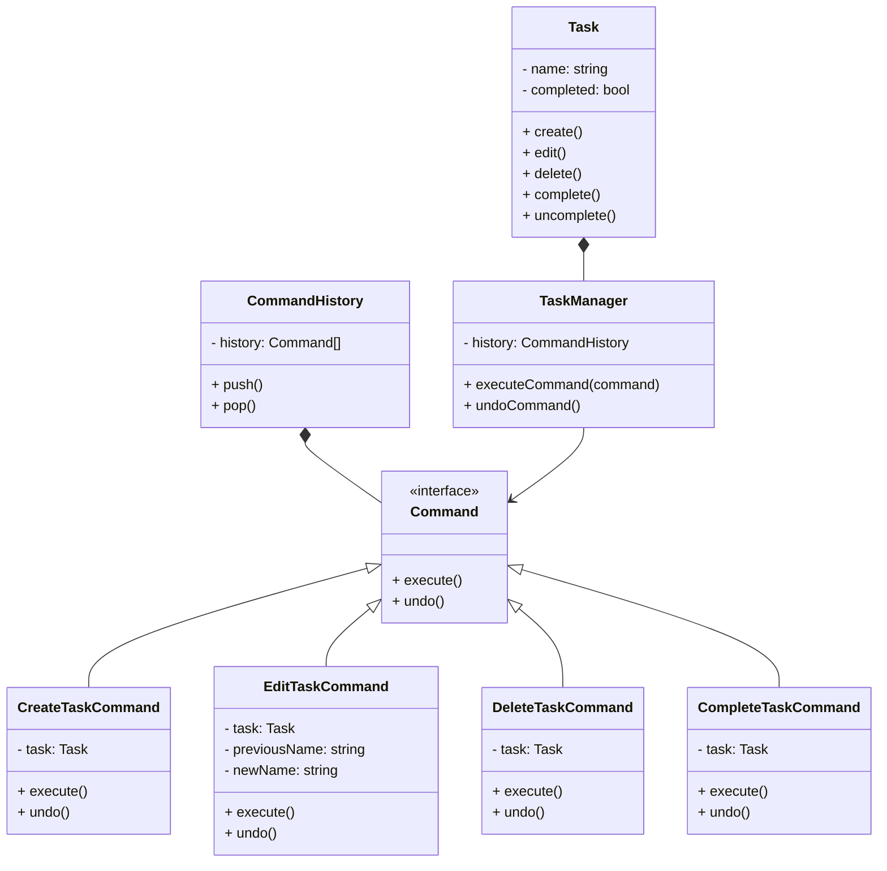
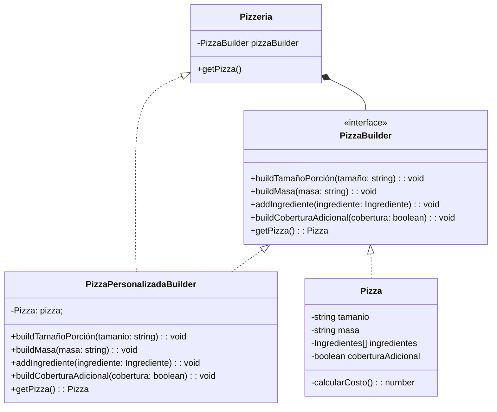
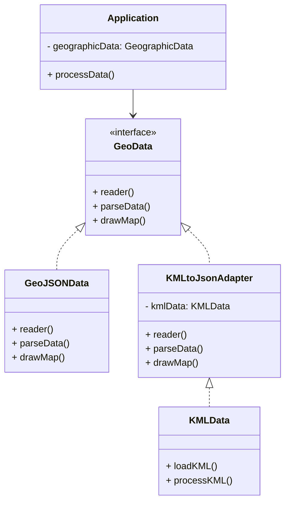

# Universidad de la Sabana

## Diplomado Arquitectura de Software - Grupo 6

### Actividad 1 - Patrones de diseño

- Carlos Leonardo Bravo Revelo
- Brian Santiago Correa Ramirez
- Angel Nicolas Mendez Parra
- Camilo Andrés Camargo Oliveros
- Fabio Andrés Sánchez Bernal

# Consideraciones

Lenguaje seleccionado **TypeScrypt**

> **Requisitos**
>
> - 1. NodeJS 18.17.0 ó superior
> - 2. Package Manager: npm ó yarn
> - 3. npm: 10.6.0 ó superior
> - 4. yarn: 1.22.18 ó superior


> **Ejecución del proyecto**
>
> - 1. Clonar repositorio
> - 2. Instalar dependencias: npm install o yarn install
> - 3. Ejecutar caso: npm run caseN ó yarn caseN

> **Estructura del Proyecto**

```
.
├── src/
│   ├── P1_ToDoCommand/
│   │  └── index.ts
│   └── P2_PizzaBuilder/
│      └── index.ts
│   └── P3_ReportsStrategy/
│      └── index.ts
│   └── P4_GeoDataAdapter/
│      └── index.ts
├── README.md
├── package.json
└── tsconfig.json
```

## Ejercicio 1 : Sistema de Gestión de Tareas

Patrón seleccionado: **Command**



##### Ejecucción

```sh
npm run case1
```

ó 

```sh
yarn case1
```

##### Resultado esperado

```sh
> actividad_1@1.0.0 npx
> ts-node src/P1_ToDoCommand/index.ts

  Task "Go to class" created.
  Task "Go to class" renamed to "Connect to the class".
  Task "Connect to the class" renamed to "Go to class".
  Task "Go to class" completed.
  Task "Go to class" deleted.
  Task "Go to class" created.
  Task "Go to class" uncompleted.
```


## Ejercicio 2. Construcción de una Orden Personalizada de Pizza

Patrón seleccionado: **Builder**



##### Ejecucción

```sh
npm run case2
```

ó 

```sh
yarn case2
```

##### Resultado esperado

```sh
> actividad_1@1.0.0 npx
> ts-node src/P2_PizzaBuilder/index.ts

  sale pizza Pizza {
    tamanio: 'mediano',
    masa: 'delgada',
    ingredientes: [
      { nombre: 'jamón', cantidad: 2 },
      { nombre: 'cebolla', cantidad: 1 }
    ],
    coberturaAdicional: false
  }
```

## Ejercicio 3. La creación de un sistema de generación de informes personalizados con diferentes formatos de salida

Patrón seleccionado: **Strategy**


##### Ejecucción

```sh
npm run case3
```

ó 

```sh
yarn case3
```

##### Resultado esperado

```sh
> actividad_1@1.0.0 npx
> ts-node src/P3_ReportsStrategy/caso3_strategy_use.ts
```

## Ejercicio 4. Problema: Integración de Biblioteca Incompatible

Patrón seleccionado: **Adapter**



##### Ejecucción

```sh
npm run case4
```

ó 

```sh
yarn case4
```

##### Resultado esperado

```sh
> actividad_1@1.0.0 npx
> ts-node src/P4_GeoDataAdapter/index.ts

  Leyendo fuente de datos GeoJson : /SRC
  Formateando datos Src
  Generando Mapa con datos Json ...
  Leyendo fuente de datos KML
  Procesando datos KML
  Formateando datos KML to Json
  Generando Mapa con KML to Json ...
```
