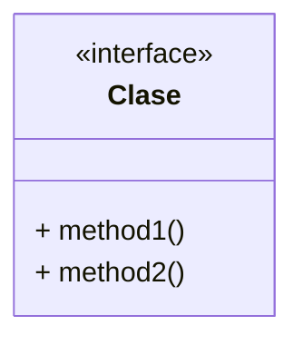
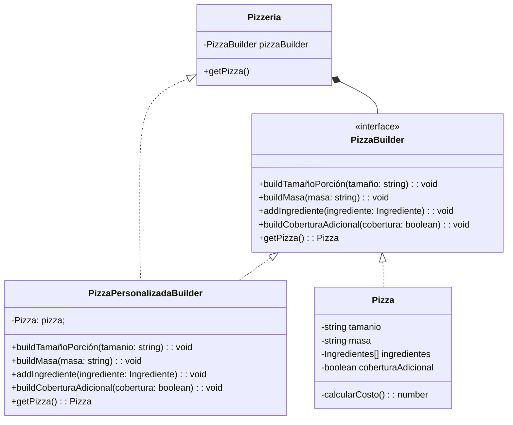
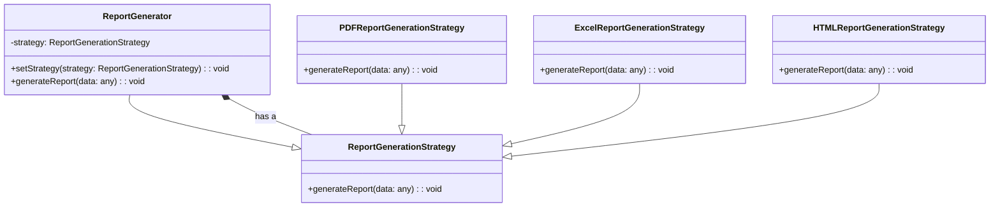
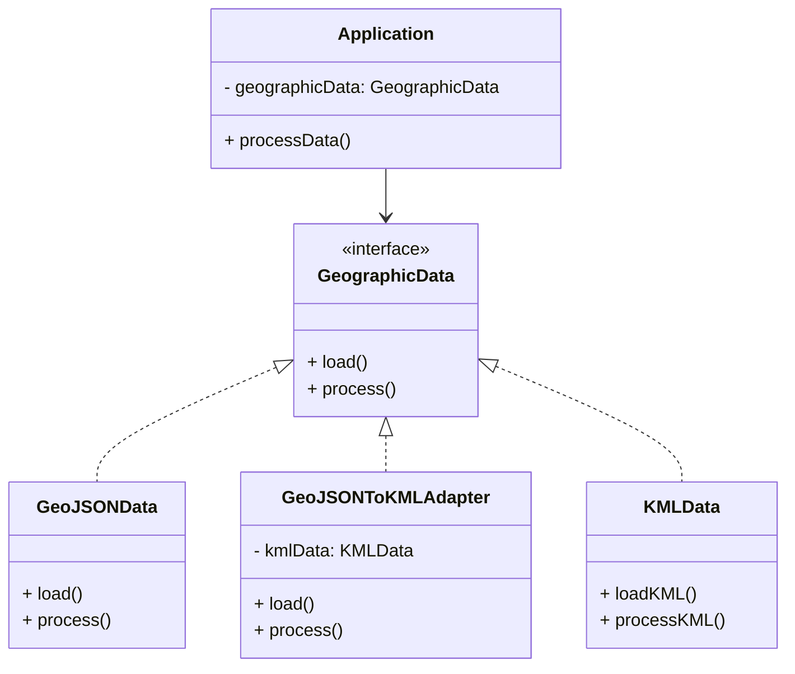

# Universidad de la Sabana 
## Diplomado Arquitectura de Software - Grupo 6
### Actividad 1 - Patrones de diseño

- Carlos Leonardo Bravo Revelo
- Brian Santiago Correa Ramirez
- Angel Nicolas Mendez Parra
- Camilo Andrés Camargo Oliveros
- Fabio Andrés Sánchez Bernal

# Consideraciones

Lenguaje seleccionado **TypeScrypt**
> **Instalación**
> - 1. Clonar reposotorio
> - 2. 

> **Ejecución del proyecto**
> - 1. Clonar repositorio
> - 2. 

## Ejercicio 1 : Sistema de Gestión de Tareas

Patrón seleccionado **Command**

## Ejercicio 2. Construcción de una Orden Personalizada de Pizza

Patrón seleccionado: **Builder**

## Ejercicio 3. La creación de un sistema de generación de informes personalizados con diferentes formatos de salida

Patrón Strategy 

## Ejercicio 4. Problema: Integración de Biblioteca Incompatible

Patrón Adapter : 

